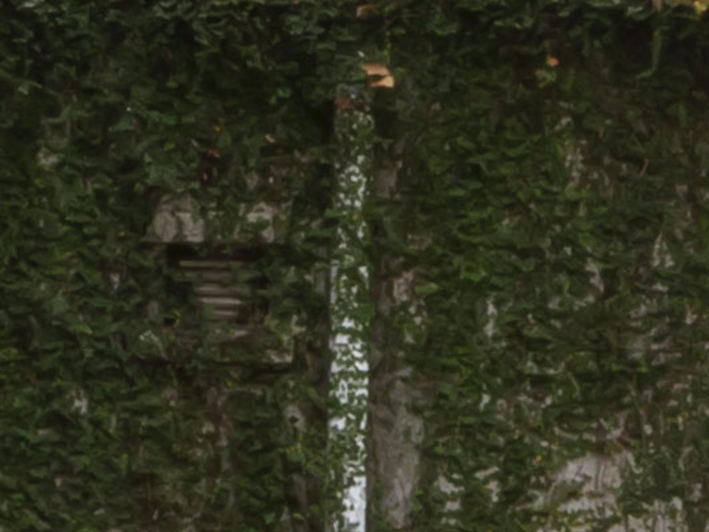
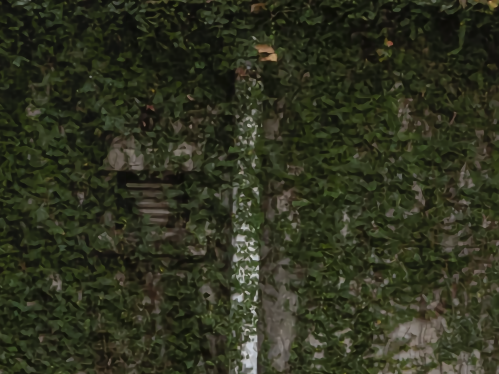

# OISR+CA : a toy example of OISR with attention
The PyTorch4.0.1 implementation of our [NTIRE2019](https://competitions.codalab.org/competitions/21439) model. Unfortunately, this model performs poorly on the real single-image super-resolution problem. It may be caused by the gap between bicubic-downsampling and this new challenge, or the poor network design, e.g., where to add the attention module (the performance of this network on benckmark datasets will be reported soon). Hopefully, OISR modules can be used in the winner models of this competition to further improve the state-of-the-arts.

### Dependencies :
* Python 3.7
* PyTorch >= 0.4.0
* numpy
* skimage
* **imageio**
* matplotlib
* tqdm

### How to use ?
1. Download the pre-processed training and validation sets from [Baidu Cloud](https://pan.baidu.com/s/1r1dtyqZo12FrVaJSTV4_7w) with code `fb0z` or from [OneDrive](https://1drv.ms/u/s!Av1MQK8mV3J8gmz3FKBlKa1SZ3BY).
2. Unzip images to the given folders:
```shell
unzip /your/download/data.zip -d /your/NTIRE2019/
```
3. Training from scratch:
```shell
cd /your/NTIRE2019/OISR/src
bash train.sh
```
4. Fine-tuning on patches, download the pre-processed training patches and validation sets from [Baidu Cloud](https://pan.baidu.com/s/1y5FQMYe96hqiuv3a0KTvZQ) with code `mu0a` or from [OneDrive](https://1drv.ms/u/s!Av1MQK8mV3J8gmtownoDhLJBwHy5):
```shell
unzip /your/download/data2.zip -d /your/NTIRE2019/
cd /your/NTIRE2019/OISR/src/
cp ../experiment/OISR/model/model_best.pt ./
bash train2.sh
cp ../experiment/OISR/model/model_best.pt ./
bash train3.sh
```
5. Evaluation on test set, download `Test_LR.zip` from [Baidu Cloud](https://pan.baidu.com/s/1-eQFiO-nj5btDI8ym7yWbA) with code `fwnh` or from [OneDrive](https://1drv.ms/u/s!Av1MQK8mV3J8gm2Xko-mFzwgRVIo):
```shell
zip /your/download/Test_LR.zip -d /your/NTIRE2019/data/benckmark/B100/
cd /your/NTIRE2019/OISR/src
cp ../experiment/OISR/model/model_best.pt ./ # or move the pre-trained model to ./
bash test.sh
python test_SRimages_rename.py # SR images can be found in ../experiment/test/results-B100
```

### Model Structure :

In this case, we apply the channel attention module (similar to SE/CBAM) to the RK-3 block.

### Image Preprocessing :
1. We use the following MatLab script to create patches:
```matlab
%% LR images augment
% NOTE THAT : The GT/LR pair should have the same filename.
clc;
clear;
%%
% src_dir = './HR';
src_dir_LR = './LR';
target_dir_LR = './new_LR';
src_dir_HR = './GT';
target_dir_HR = './new_GT';
src_filenames = dir(fullfile(src_dir_LR, '*.png'));

N = length(src_filenames);

for i = 1:N
    try
        I = imread([src_dir_LR, '/', src_filenames(i).name]);
        src_new_filename = [target_dir_LR, '/', src_filenames(i).name];
        degree = randi(360);
        degree = (degree - mod(degree, 90)); % comment this line to create more challenging patches
        J = imrotate(I, degree, 'bicubic', 'crop');
        [~, rect] = imcrop(J);
        rect = round(rect);
        J = imcrop(J, rect);
        imwrite(J, src_new_filename);

        I = imread([src_dir_HR, '/', src_filenames(i).name]);
        src_new_filename = [target_dir_HR, '/', src_filenames(i).name];
        J = imrotate(I, degree, 'bicubic', 'crop');
        J = imcrop(J, rect);
        imwrite(J, src_new_filename);
    catch
        disp('skip.');
    end
end
```
2. We trim the cropped patches to 100N x 100N:
```Matlab
%% Trim
clc;
clear;
%%
target_dir_LR = './new_LR';
target_dir_HR = './new_GT';
src_filenames = dir(fullfile(target_dir_LR, '*.png'));

N = length(src_filenames);

for i = 1:N
    I = imread([target_dir_LR, '/', src_filenames(i).name]);
    src_new_filename = [target_dir_LR, '/', src_filenames(i).name];
    [W, H, ~] = size(I);
    W = W - mod(W, 100);
    H = H - mod(H, 100);
    imwrite(I(1:W, 1:H, :), src_new_filename);
    
    I = imread([target_dir_HR, '/', src_filenames(i).name]);
    src_new_filename = [target_dir_HR, '/', src_filenames(i).name];
    [W, H, ~] = size(I);
    W = W - mod(W, 100);
    H = H - mod(H, 100);
    imwrite(I(1:W, 1:H, :), src_new_filename);
end
```

### Pre-trained models :
* [Baidu Pan](https://pan.baidu.com/s/1vIp8JZAc_vyK7a7rdO029A) with code `7l6x`
* [OneDrive](https://1drv.ms/u/s!Av1MQK8mV3J8gm_e1MGdpYry0G-u)

### Loss Function :
Inspired by the `smoothL1loss` in object detection, we use smooth L1 loss in this competition:

^2,&\text{if}|x_i-y_i|<1)


### Representative images :
* LR:


* SR:


* LR:


* SR:

