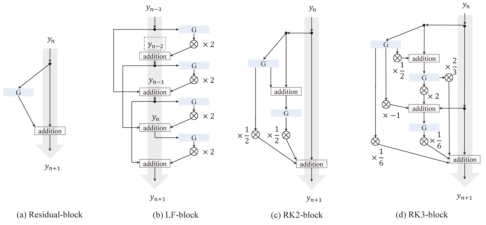
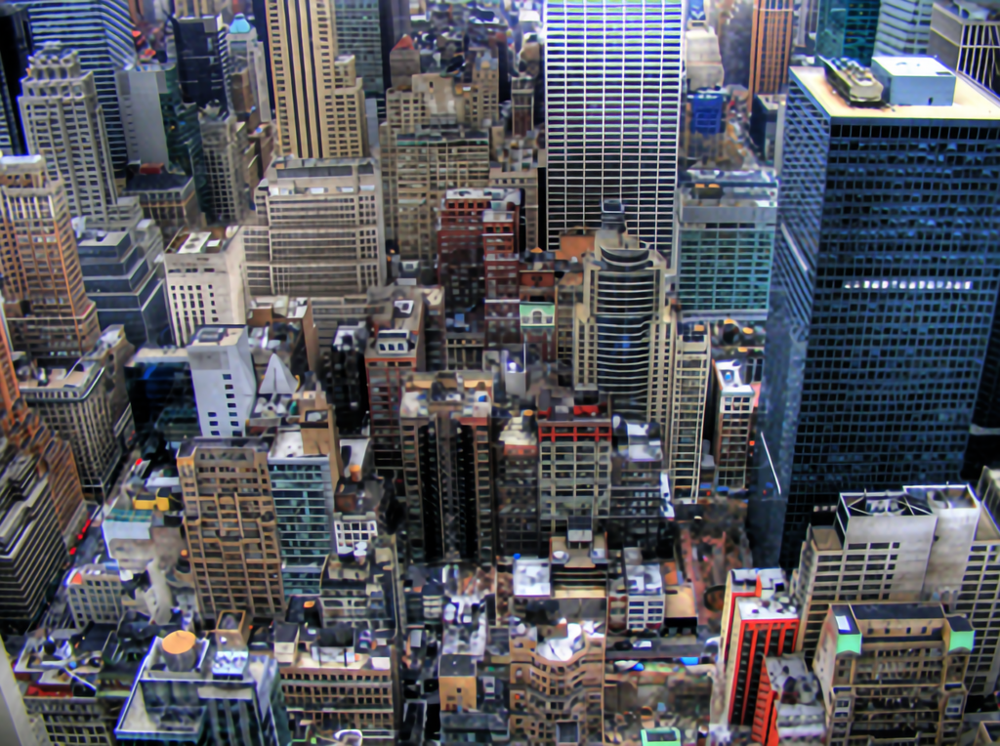
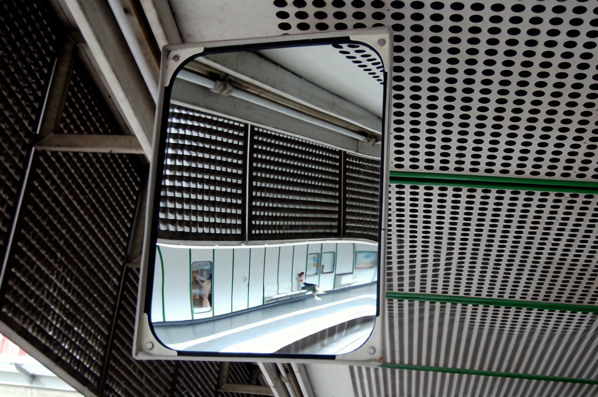
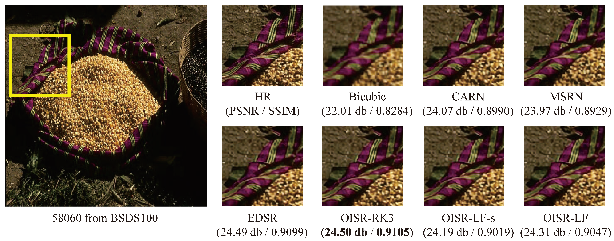

# OISR-PyTorch
PyTorch implementation of "ODE-inspired Network Design for Single Image Super-Resolution". This code is built on [EDSR](https://github.com/thstkdgus35/EDSR-PyTorch) (PyTorch). We would like to thank the authors for sharing their codes!

### Dependencies :
* **Python 3.7**
* **PyTorch 0.4.1**
* numpy
* skimage
* imageio
* matplotlib
* tqdm

### How to use ?
The code structure of this project is the same as [EDSR](https://github.com/thstkdgus35/EDSR-PyTorch), except that we change the definition of residual block (`src/model/common.py`) to Leapfrog / Heun / 3-stage Runge-Kutta blocks and reset the number of residual blocks. The training and testing scripts remain relatively unchanged. All datasets used in this work can be found here \[[1](https://cv.snu.ac.kr/research/EDSR/benchmark.tar),[2](https://cv.snu.ac.kr/research/EDSR/DIV2K.tar)\].

### Pretrained models :
model | Param | Set5 | Set14 | B100 | Urban100 | OneDrive | Baidu Pan
------------ | ------------- | ------------- | ------------- | ------------- | ------------- | ------------- | -------------
RK2-s | 1.52M | 32.21 | 28.63 | 27.58 | 26.14 | [Link](https://1drv.ms/u/s!Av1MQK8mV3J8gnNxeXiDCYfijePQ) | [Link](https://pan.baidu.com/s/1DFr5Pr5E3Pw9cf6q-Y0XYg) (u26w)  
LF-s | 1.52M | 32.14 | 28.63 | 27.60 | 26.17 | [Link](https://1drv.ms/u/s!Av1MQK8mV3J8gnbrjMgwSd1E7Dow) | [Link](https://pan.baidu.com/s/15CL-tjoUaJDhL514CR0kiA) (b971)
RK2 | 5.50M | 32.32 | 28.72 | 27.66 | 26.37 | [Link](https://1drv.ms/u/s!Av1MQK8mV3J8gnURfxj_gsAizHCD) | [Link](https://pan.baidu.com/s/1CrmdsURJw0jfQIw3UqqF0w) (88f7)
LF | 5.50M | 32.33 | 28.73 | 27.66 | 26.38 | [Link](https://1drv.ms/u/s!Av1MQK8mV3J8gnTmRQ8d6wVJtp5Z) | [Link](https://pan.baidu.com/s/16aAVOXAQhCwHM5yhIzxing) (19qt)
RK3 | 44.27M | 32.53 | 28.86 | 27.75 | 26.79 | [Link](https://1drv.ms/u/s!Av1MQK8mV3J8gndKfnbNbY0ydkVx) | [Link](https://pan.baidu.com/s/1-rkXZsQTfp0g7nGB4hSzow) (xc1h)

We report the 4x PSNR(dB) results on benckmark datasets.

### Model Structures :


### Representative images (4x) :
* LR


* OISR-RK3


* LR


* OISR-RK3


* LR


* OISR-RK3


* Urban100


* B100


You can download some results from [here](https://1drv.ms/u/s!Av1MQK8mV3J8gng54ftWgdCT1i7C). This link contains RK3-x3/x4 Urban100 and B100 results. You can easily generate result images with `test.sh` scripts.

### Q&A :
1. The improvement of OISR is limited, compared with NTIRE2018 top rankers.

We admit that the ODE-inspired network design remains experimental, so far it just gives us a different point of view to understand SR problems. It could be a new direction and deserves more attentions of the community (e.g., [Neural Ordinary Differential Equations](https://arxiv.org/abs/1806.07366) in [NeurIPS2018](https://neurips.cc/Conferences/2018/Awards) is encouraging).

2. More diverse comparative experiments should be involved, since there are many numerical ODE methods.

Due to the limited computing resources, we only evaluate a few network structures at the present time. **It is possible that there exists another better architecture, or, more likely, many attempts may not even converge**. Note that we only focus on the **order** of numerical ODE methods intuitively. It is only one of the central concepts in numerical analysis (also includes convergence and stability). To the best of our knowledge, there is no correspondence **strictly** between numerical ODEs and deep neural networks in numerical analysis, but utlizing convergence, consistency and order, and stability and stiffness may further explain the emprical success of the existing methods and the potential failures.  


### References : 
```
@InProceedings{Lim_2017_CVPR_Workshops,
  author    = {Lim, Bee and Son, Sanghyun and Kim, Heewon and Nah, Seungjun and Lee, Kyoung Mu},
  title     = {Enhanced Deep Residual Networks for Single Image Super-Resolution},
  booktitle = {The IEEE Conference on Computer Vision and Pattern Recognition (CVPR) Workshops},
  month     = {July},
  year      = {2017}
}

@article{OISR,
  author    = {Xiangyu He and Zitao Mo and Peisong Wang and Yang Liu and Mingyuan Yang and Jian Cheng},
  title     = {ODE-inspired Network Design for Single Image Super-Resolution},
  booktitle = {2019 {IEEE} Conference on Computer Vision and Pattern Recognition},
  month     = {July},
  year      = {2019}
}
```
